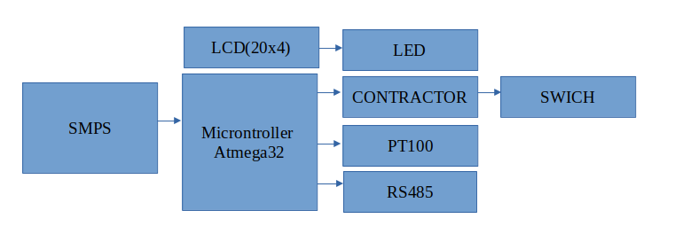
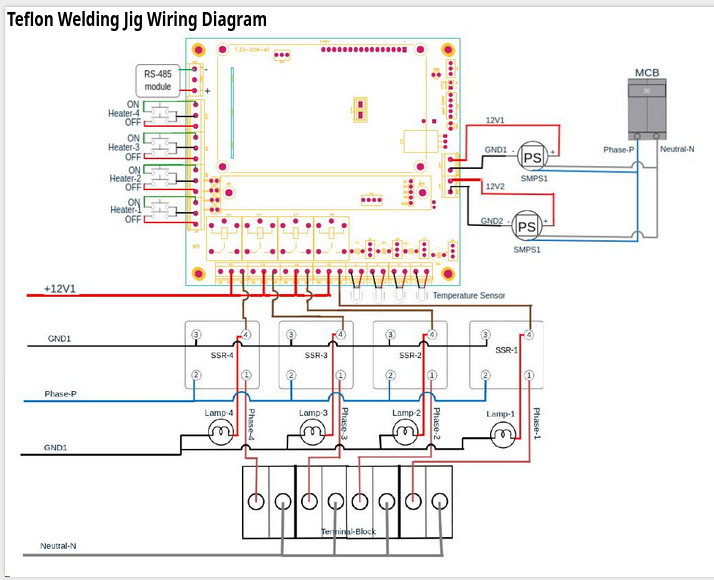

# Teflon-Welding-JIg
Non-Commercial Usage - Automate production Sapcon Instruments Pvt. Ltd. 
https://www.sapconinstruments.com/
# Teflon Welding Jig – Temperature Controller  

A microcontroller-based **temperature control system for Teflon welding jigs**, designed for precise heater control, real-time temperature monitoring, and industrial-grade operation.

This project demonstrates **embedded systems, industrial automation, and temperature control design** using ATmega32, PT100 sensors, and SSR-based heater driving.

---

## Project Overview  

The Teflon Welding Jig Temperature Controller is built around the **ATmega32 microcontroller**.  
It controls multiple heating zones, reads temperature using **PT100 RTD sensors**, displays system status on a **20x4 LCD**, and communicates externally through **RS485**.

The system is powered by an **SMPS** and wired using proper industrial safety practices, making it suitable for real-world manufacturing environments.

---

##  System Block Diagram  

Main modules:
- SMPS Power Supply  
- ATmega32 Microcontroller  
- LCD (20x4) Display  
- PT100 Temperature Sensors  
- RS485 Communication  
- Contactor / SSR Drivers  
- LED Indicators & Switch Inputs  

---

##  Teflon Welding Jig Wiring Diagram  

This wiring design includes:
- Multi-channel heater outputs  
- Solid State Relay (SSR) isolation  
- PT100 sensor interfacing  
- 12V SMPS distribution  
- MCB-based protection  
- Industrial terminal blocks  

---

## Hardware Used  

- ATmega32 Microcontroller  
- PT100 RTD temperature sensors  
- Solid State Relays (SSR) / Contactors  
- 20x4 LCD display  
- RS485 communication module  
- 12V SMPS  
- Heaters, MCB, terminal blocks, switches  

---

## Firmware Features  

- Real-time temperature acquisition  
- Closed-loop heater control  
- Multi-zone heating support  
- Live status display on LCD  
- RS485 communication ready  
- Industrial-safe control logic  

---

## Applications  

- Teflon welding machines  
- Heat sealing equipment  
- Industrial temperature controllers  
- Plastic processing machines  
- Custom welding jigs  

---

## Recommended Repository Structure  

Teflon-Welding-Jig/
│
├── README.md
├── firmware/
│   └── main.c
    └── other linking files 
├── hardware/
│   ├── schematic.pdf
│   └── pcb_layout.png
├── block_diagram.png
└── wiring_diagram.png

---

## How to Add Images  

1. Upload your images to the root of the repository  
   - teflon_welding_jig_block.png 
   - teflon_welding_jig_wiring_diagram.png

2. Use this syntax in README:

  

---

## Future Enhancements  

- PID temperature control  
- Modbus RTU communication  
- Data logging  
- Touchscreen HMI  
- Over-temperature safety shutdown  
- IoT monitoring dashboard  

---

## Author  

Prajaktaa Deokar  
Embedded Systems | Industrial Automation | Temperature Control Systems  
